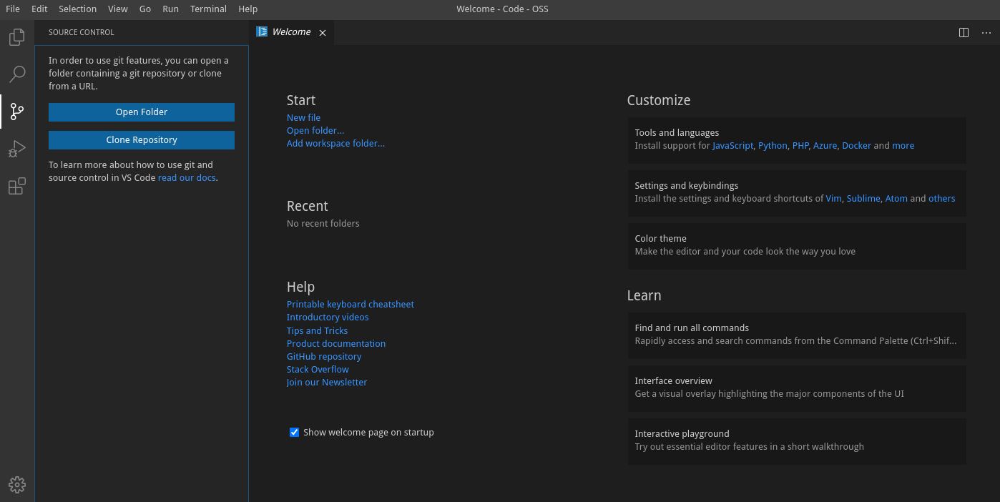

# 1 - Prerequisites

You will need an Red Hat network account to be able to download the JBoss EAP installation zip files.  The account you use must not be managed by SSO in order for the Ansible scripts to be able to authenticate.  You can create a new account by following the instructions in the [Red Hat Customer Portal](https://sso.redhat.com/auth/realms/redhat-external/login-actions/registration?client_id=customer-portal&tab_id=RiPOv96eZ74).  You will need to use these credentials when you run the ansible playbooks later in the workshop.

## Set up the environment

This workshop requires the provisioning of the following RHPDS environment.  Once this environment is provisioned your will have the following:

* A bastion node, serving a VS Code Server IDE, which can be used to run the workshop
* 2 x App Servers, which will host JBoss EAP
* 1 x db server, which will host Postgresql
* 1 x frontend server, which will host the load balancer

To start the workshop, open the url of your bastion server in a browser. You will be prompted to login.  The default password is "changme".  Once you login to the IDE you will be able to clone the workshop repository.

Open the git panel of the IDE and click on "Clone Repository" and enter the following url:

TODO - Insert git url here - TODO



You will be prompted to select the folder to clone the repo to, choose the default folder, "/home/devops"

You will then be prompted to open the folder in VS Code.

## Check ansible hosts

From the VS Code IDE, open a new terminal by clicking on the "Terminal" menu.

From the terminal enter the follwing command to copy over the pre-prepared ansible hosts file:

``` cp /etc/ansible/hosts ./inventory ```


Open the file `inventory/hosts`, you should see the ip addresses of your RHEL nodes listed as shown below.

```
# Placeholder Group
[demo]

# jboss Group
[jboss]
192.168.122.64 
192.168.122.224 

# postgres database Group
[pgsql]
192.168.122.20

# jcbs Group
[jbcs]
192.168.122.247

[demo:children]
jboss
pgsql
jbcs

```

## Test ansible hosts
Once we have checked the hosts file we can test the ansible hosts file by running the following command.

```ansible -i inventory/hosts demo -m ping```

You should see the following output:

```
192.168.122.64 | SUCCESS => {
    "ansible_facts": {
        "discovered_interpreter_python": "/usr/libexec/platform-python"
    },
    "changed": false,
    "ping": "pong"
}
192.168.122.224 | SUCCESS => {
    "ansible_facts": {
        "discovered_interpreter_python": "/usr/libexec/platform-python"
    },
    "changed": false,
    "ping": "pong"
}
192.168.122.247 | SUCCESS => {
    "ansible_facts": {
        "discovered_interpreter_python": "/usr/libexec/platform-python"
    },
    "changed": false,
    "ping": "pong"
}
192.168.122.20 | SUCCESS => {
    "ansible_facts": {
        "discovered_interpreter_python": "/usr/libexec/platform-python"
    },
    "changed": false,
    "ping": "pong"
}
```

We've checked our environment, now we can continue with the workshop and add the required ansible collections.

Next [Step 2](./2-adding-collections.md)