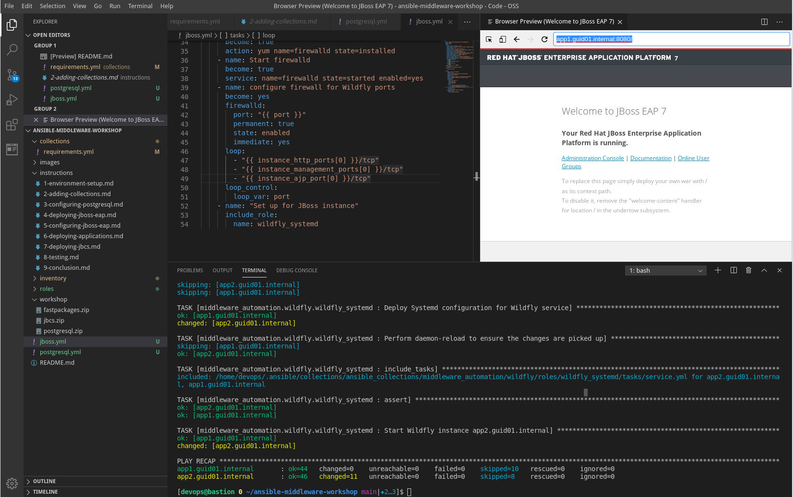

# 4 - Deploying JBoss EAP

Next thing we're going to do is deploy JBoss EAP.  To do this we'll create a jboss playlist by creating a file jboss.yml in the top level folder.

Copy the contents of the following file into jboss.yml:

```
---
- name: "JBoss EAP installation and configuration"
  hosts: jboss
  become: yes
  vars:
    wildfly_install_workdir: '/opt'
    install_name: "{{ override_install_name | default('jboss') }}"
    jboss_version: "7.4"
    wildfly_version: "{{ jboss_version }}"
    wildfly_archive_filename: "{{ install_name }}-eap-{{ wildfly_version }}.zip"
    wildfly_user: "{{ install_name }}"
    wildfly_config_base: standalone-ha.xml
    wildfly_home: "{{ wildfly_install_workdir }}/{{ install_name }}-eap-{{ wildfly_version }}"
    wildfly_basedir_prefix: "/opt/{{ install_name }}"
    wildfly_config_name: "{{ install_name }}"
    wildfly_port_range_offset: 0
    wildfly_instance_name: "{{ inventory_hostname }}"
    service_systemd_env_file: "/etc/{{ install_name }}.conf"
    service_systemd_conf_file: "/usr/lib/systemd/system/{{ wildfly_instance_name }}.service"
    instance_http_ports:
      - 8080
    instance_management_ports:
      - 9990
    instance_ajp_port:
      - 8009
    jboss_eap_rhn_id: "99481"
  collections:
    - middleware_automation.wildfly
  roles:
    - wildfly_install
    
  tasks:
    - name: install firewalld
      become: true
      action: yum name=firewalld state=installed
    - name: Start firewalld
      become: true
      service: name=firewalld state=started enabled=yes
    - name: configure firewall for Wildfly ports
      become: yes
      firewalld:
        port: "{{ port }}"
        permanent: true
        state: enabled
        immediate: yes
      loop:
        - "{{ instance_http_ports[0] }}/tcp"
        - "{{ instance_management_ports[0] }}/tcp"
        - "{{ instance_ajp_port[0] }}/tcp"
      loop_control:
        loop_var: port    
    - name: "Set up for JBoss instance"
      include_role:
        name: wildfly_systemd
```

Have a look at the yaml we just copied, it's relatively straight forward.  First thing the file does is setup the environment variables required for the installation. 

This file includes the wildfly collection and uses the wildfly_install role to install JBoss EAP. Note: The wildfly_install role will check for the presence of environment variables rhn_username and rhn_password and if they are present it will download and install JBoss EAP instead of Wildfly.

Once JBoss is installed, the tasks perform the following actions:

* Install and configure the firewall to allow access to the ports required by JBoss EAP. The firewall is opened an all ports for http traffic, management traffic, and ajp traffic (used by mod_cluster).
* Run the widlfly_systemd role to configure the JBoss EAP instance as a systemd service.

## Running the playbook

To run the playbook we'll run the following command, you will need your Red Hat network credentials that we created in section 1: 

`ansible-playbook -i ./inventory/hosts jboss.yml --extra-vars "rhn_username=<your rhn login> rhn_password=<your rhn password>"`

Once this command completes, you should see something like:

```

PLAY RECAP ***************************************************************************************************************
192.168.122.224            : ok=51   changed=6    unreachable=0    failed=0    skipped=11   rescued=0    ignored=0   
192.168.122.64             : ok=51   changed=6    unreachable=0    failed=0    skipped=11   rescued=0    ignored=0   

```

## Testing the installation

To test the install, open your browser and navigate to the ip address of one of the JBoss EAP app servers on port 8080, e.g. http://192.168.122.224:8080, hint: the ip addresses are shown in the output of the previous command. You should see something like:



Now that JBoss EAP is installed, let's move on to the next section, configuring JBoss EAP.

Next [Step 5](./5-configuring-jboss-eap.md)