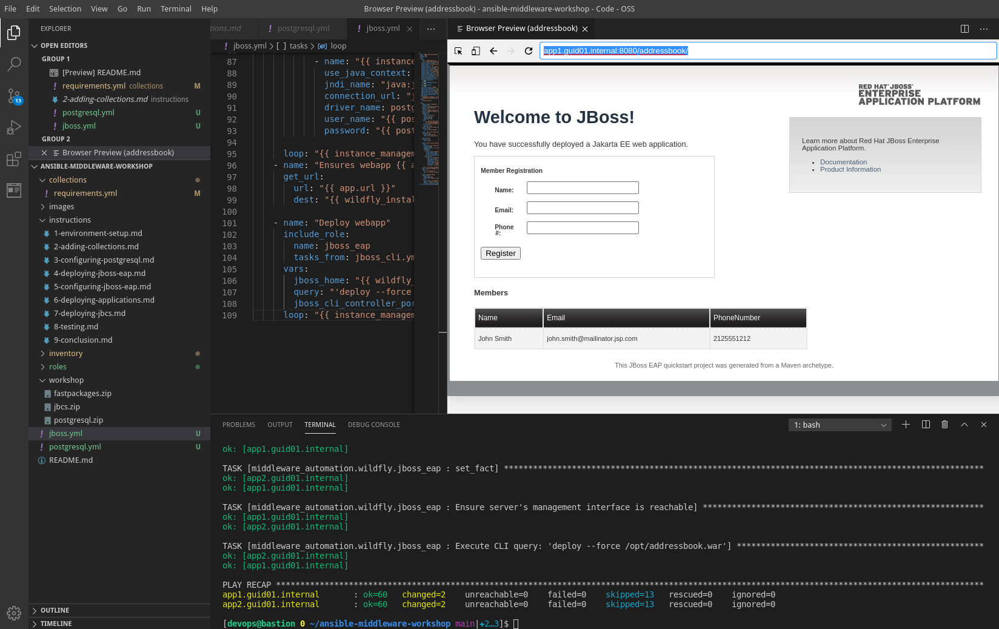

# 6 - Deploying an application

Now that JBoss EAP is deployed and configured, we can deploy our application.  To do this we'll need to provide a pre-built war file.  For the purpose of this workshop we've already prepared a war file and made it available in S3.  This war file will use the postgresql datasource to persist addressbook records.

First thing we'll do is add details of the app to the vars section of the jboss.yml file.  We'll need to provide the following details:

```
    app:
      name: 'addressbook.war'
      url: 'https://gpte-public.s3.amazonaws.com/addressbook.war'
```

Next we'll add the following to the tasks section of the jboss.yml file to download the application:

```
    - name: "Ensures webapp {{ app.name }} has been retrieved from {{ app.url }}"
      get_url:
        url: "{{ app.url }}"
        dest: "{{ wildfly_install_workdir }}/{{ app.name }}"
```

Finally we'll add the following to the end of the tasks section of the jboss.yml file to deploy the application:

```
    - name: "Deploy webapp"
      include_role:
        name: jboss_eap
        tasks_from: jboss_cli.yml
      vars:
        jboss_home: "{{ wildfly_home }}"
        query: "'deploy --force {{ wildfly_install_workdir }}/{{ app.name }}'"
        jboss_cli_controller_port: "{{ item }}"
      loop: "{{ instance_management_ports }}"
```

Save changes to jboss.yml and re-run the playbook.

Once the playbook is complete, you should be able to access the application.

# Testing the application

To test the install, use the Browser Preview and open the url http://app1.xxxxx.internal:8080/addressbook (replace xxxxx with the guid of your workshop, you can find this from the previous ansible command) you should see the addressbook application.



Now that the application is deployed, let's move on to the next section, deploying the load balancer.

Next [Step 7](./7-deploying-jbcs.md)